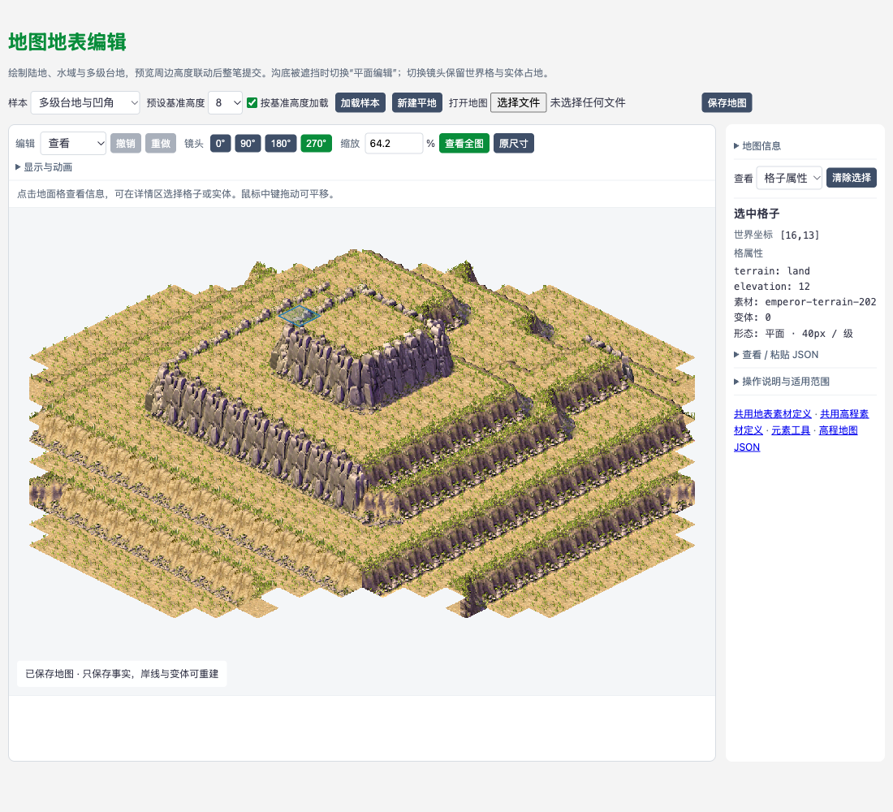
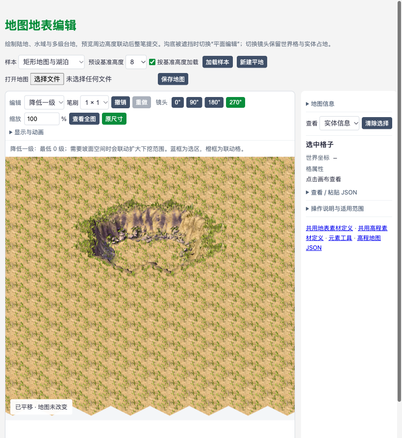
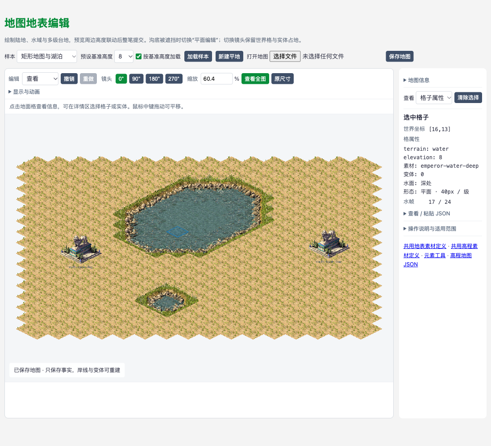
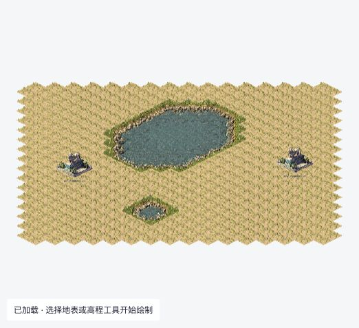

# 地图校验、实体消费、编辑与文件 IO

`src/maps/index.js` 是可选源码入口，提供 `validateMapDefinition`、`resolveMapEntities`、`buildMapOccupancy`、`checkMapEntityPlacement`、`applyMapEdit`、`importMapDefinition` 与 `exportMapDefinition`。不加入核心导出，模块不包含文件读写或场景渲染。下方 Demo 在既有接口上增加工具层地表编辑，未新增公共 API。

独立浏览器项目可直接加载 `dist/qtiled-maps.umd.js`，使用 `window.qtiledMaps`；无需 SpriteJS 或源码解析。路径、构建命令及真实文件调用例见[正式产物消费](browser-consumption.md)。

## 测试验证

[地图定义用例](../__tests__/map-definition.test.js) 覆盖二维矩阵、无效格、必需属性、素材引用与类别、实体姿态、错误路径及修正恢复；同时检查数组空洞、undefined、NaN、无穷数和安全整数等 JavaScript 输入边界，以及冻结输入不被修改、可选字段不被自动补齐。

运行 `npm test -- --runInBand __tests__/map-definition.test.js` 执行定向测试，运行 `npm test -- --runInBand` 执行全量回归。测试内定义样本，不依赖本机 output 文件或浏览器。

## 源码使用

```js
import { validateMapDefinition } from '../src/maps/index';

const map = {
  version: 1,
  id: 'first-map',
  tileSize: [80, 40],
  cells: [[{ terrain: 'land', elevation: 0 }, null]],
  entities: [],
};
const issues = validateMapDefinition(map); // 合法输入返回 []
```

## 数据约定

- `cells[y][x]` 是从 0 开始的世界格坐标；各行非空且等宽，不接受数组空洞，至少有一个有效格。`null` 表示无效格，有效格必须是对象。
- cell 的 `terrain` 为非空地形标识；v1 的 `elevation` 必须为数字 0，v2 为 0 到 16 的安全整数。可选 `tile` 是底图元素 ID，省略表示未贴图；旧的 0/字符串格值不再接受。
- 地形标识和底图素材引用分开。换底图不自动改变地形，校验通过不表示已解析地形玩法规则。
- `entities` 是实例数组，每项为 `{ id, element, grid, angle? }`。实例 ID 在地图内唯一；grid 是两个安全整数，可以为负数；省略 angle 表示 0°，显式提供时只能为数字 0/90/180/270。
- version 必须为数字 1 或 2，地图 id 为非空字符串，tileSize 是两个有限正数，允许小数和非 2:1 比例。v2 额外必填 `elevationStep`，它是有限正数，表示每级高程对应的原生投影像素高度。
- 附加字段保持原样，但不会启用未定义的能力；cell 内的 x/y、entities 不作为坐标或实例来源。

## v2 高程与平整地基

```js
const elevatedMap = {
  version: 2,
  id: 'raised-platform',
  tileSize: [80, 40],
  elevationStep: 40, // 当前原作一级地表素材包采用的像素/级
  cells: [[{ terrain: 'land', elevation: 2 }]],
  entities: [],
};
```

v2 是 QTiled 工具地图数据约定，不是原作地图格式。`elevationStep` 明确保存像素/级换算；地图不会隐式从 tileSize 推断，导入 v1 也不会自动升版。v1 仍只允许零高程，并保留附加字段的旧行为。原作素材在某个规则包中使用何种单位、锚点和边界形态，由该规则包的证据和消费逻辑决定。

结构层接受 v2 高处的 `cell.tile`，不擅自判定岸线、坡道或通行。场景工具可以进一步拒绝不支持的地形组合，并在整笔修改前解释原因。`validateMapDefinition` 本身不检查实体地基；`buildMapOccupancy`、`checkMapEntityPlacement`、`applyMapEdit`、导入/导出都会检查完整占地，v2 实体必须由同一高程的全部有效格承托。

v2 的 `resolveMapEntities` 也先检查地基；成功后以真实占地第一格的高度，给传入视图的 `originPixel.y` 减去 `elevation * elevationStep`，复用 `resolveElementDraw` 同时更新精灵位置、原点、placementOrigin 与所有占地投影。定义原点不一定属于占地，因此不能读取原点格猜高度。世界 `grid`、旋转占地、镜头素材选择、图片 rect 和 anchor 均不改变，输出字段保持原状。地表顶面/侧面绘制及命中不在本模块中实现。

跨高差错误为 `footprint-elevation-mismatch`，附带 `entities[n]` 路径、`entityId` 和相对首个有效占地格不同高的 `grid`。检查先于共存回调，失败不暴露部分索引、地图或实体。删除一个跨高差实体可以修复占地问题，仍不能绕过结构错误。IO 保存 version、elevationStep 和格高程事实，不保存投影、占用索引或临时笔刷。

## 素材引用与检查边界

有素材引用时，调用 `validateMapDefinition(map, elementsById)`。元素库由调用方准备，值须预先通过 `validateElementDefinition`，键须与定义 id 一致；此函数不访问图片、文件或网络。

cell.tile 必须引用 `kind: 'tile'` 且 footprint 恰为 `[[0,0]]` 的元素；entity.element 必须引用 `kind: 'sprite'` 的元素。未引用的库项不影响结果，不重复检查图片裁切和尺寸。

问题列表每项为 `{ path, code, message }`，例如 `cells[0][1].terrain` 或 `entities[1].element`。先检查顶层字段，再按行列检查 cells，最后检查实体；父结构非法时跳过相应子检查。失败不修改输入，不补默认字段，不生成半有效地图。

本函数只检查地图结构及素材引用。同格多个实例、实体占地越界或重叠不在此处判断；完整占地和共存规则由下述 A4 接口负责。通行、可建造、风水及五行结果也不由本函数生成。

## 实体消费

[专项用例](../__tests__/map-entities.test.js) 覆盖 20 格双实例、16 种镜头/对象组合、既有矩形放置结果的重新消费、完整不规则占地、失败恢复与冻结输入。运行 `npm test -- --runInBand __tests__/map-entities.test.js`。此处只计算实体绘制信息，不包含播放时钟。

`resolveMapEntities(map, elementsById = {}, view = {})` 先调用上述校验器。成功返回 `{ entities: [...], issues: [] }`；地图无效时返回 `{ entities: null, issues }`，问题路径和代码与校验器一致，不产生部分结果。合法的空实体集合返回 `entities: []`。

元素库须先通过 元素校验。此函数直接引用纯计算的 `element-rendering/draw`，不引入 SpriteJS、图片加载或浏览器 API。`view` 仅消费镜头 `angle`（缺省 0）和 `originPixel`（缺省 `[0,0]`）；瓦片尺寸始终来自地图，不消费额外的 `view.tileSize`。每个实体的投影沿用 元素绘制参数约定，非法镜头参数由既有绘制函数抛错。

```js
import { resolveMapEntities } from '../src/maps/index';

// map 和元素库已由调用方准备，库内定义已通过 元素校验。
const result = resolveMapEntities(map, elementsById, {
  angle: 90,
  originPixel: [320, 240],
});
// result.issues 为空后消费 result.entities；以下描述不是保存格式。
// { id: 'dog-a', element: 'sculpture-dog-preview',
//   grid: [1,1], angle: 0, draw: { ... } }
```

每项只包含实例 `id`、素材引用 `element`、定义原点世界格 `grid`、对象 `angle` 和 `draw`。`draw` 沿用 [元素绘制结果](element-rendering.md#绘制计算)：其中 `id` 为元素 ID，`angle` 为镜头角度，`objectAngle` 为对象朝向，`imageAngle` 决定素材槽；`footprint` 给出全部 `{grid,position}`。同一元素可产生多个独立实例，顺序与输入一致，不代表遮挡画序。返回的数组不与输入或其他实例共享可修改状态；不回写缺省 angle，不复制附加业务字段到派生结果。

实体的 `grid` 已是定义原点，读取或转镜头直接传入 `resolveElementDraw`，不再调用 `resolveElementPlacement`。切镜头仅更新投影和素材槽。新放置/对象转向时，调用方先用既有矩形放置函数计算配套 `grid/objectAngle`，再将它们作为实体 `grid/angle`；下述编辑命令接收已经确定姿态的新实体，不提供转向命令。

完整 footprint 不裁剪到 cells：v1 保留原有行为，界外占地等仍可派生，A4 再检查有效格和共存。v2 绘制前先复用完整占地检查，任何占地格越界、为 null 或与同一实体其他占地格不等高，均拒绝整组实体绘制；同格共存仍由 A4 的调用方规则判断。`resolveMapEntities` 不计算 cell.tile 的绘制结果、不创建空间索引或场景节点。

## 完整占地与按格索引

`buildMapOccupancy(map, elementsById = {}, canCoexist = () => true)` 先复用 A2 校验，再用与绘制相同的 `rotateGridPoint`、`getIsometricNeighborsByOffsets` 计算完整世界占地。没有镜头输入，也不投影像素或重新定位原点。元素库仍须先通过元素契约校验；占地必须非空且不重复，计算所得世界格须为安全整数。

逐格检查矩阵边界与 null 无效格，保留每一个失败格的诊断；不会裁切占地或把包围盒内的空洞补成占地。定义原点不代表实际占地：原点位于矩阵外或 null 格，但全部占地有效时可以通过。合法姿态的不规则占地可以检查；新对象如何原地转向仍由既有放置规则负责。

成功返回 `{ index, issues: [] }`，`index` 是 `Map<string, string[]>`。键为世界坐标的 `"x,y"`，值为该格关联的唯一实例 ID 列表；只索引实体实际占地，cell.tile 不产生实例。格键遍历顺序按输入实体及其 footprint 顺序首次插入，同格 ID 按 `map.entities` 输入顺序排列，不排序 ID、不依赖镜头或像素画序。输入实体换序会相应改变查询顺序。有效空地图得到空 Map；任一错误返回 `{ index: null, issues }`，不暴露部分索引。

```js
import { buildMapOccupancy, checkMapEntityPlacement } from '../src/maps/index';

// map、elementsById 已准备；这里的容量仅为调用方场景规则示例。
const canCoexist = ({ entities }) => entities.length <= 2;
const result = buildMapOccupancy(map, elementsById, canCoexist);
if (!result.issues.length) {
  const grid = [1, 1];
  const ids = result.index.get(grid.join(',')) || [];
  // ids 按地图实例顺序列出，可再通过实例 ID 查询地图事实。
}

const candidate = { id: 'dog-new', element: 'sculpture-dog-preview', grid: [1, 1] };
const placement = checkMapEntityPlacement(map, candidate, elementsById, canCoexist);
// placement 为 { allowed, issues }，不写入 map.entities。
```

索引只属于本次计算，是派生快照，不写入地图 JSON；函数不缓存、不接收或更新旧索引。修改事实后重新构建并在成功时替换调用方保存的索引。同格删除一个实例后，其他实例引用按原顺序保留。返回的 Map/数组由调用方持有，可修改，但不会影响输入、其他格或后续重建。

### 场景共存规则与候选检查

缺省规则允许所有几何有效的同格共存；这只表示通用占地检查通过，不代表某种游戏的建造、通行、接路或风水规则通过。传入 `() => false` 可拒绝全部同格共存，或根据实例 ID/元素 ID 和外部场景配置实现选择性规则，不要求给地图添加游戏分类字段。

几何全部通过后，每个至少含两个实例的共享格调用一次 `canCoexist({ grid, entities })`。`entities` 是该格的完整实例集合，按输入顺序提供 `{ id, element, grid, angle }`；缺省对象角度归一为 0，附加业务字段不复制。回调可检查三实例容量等集合条件，不局限于两两比较；规则应为确定性的纯函数。调用时传入独立副本，修改参数不会改动地图或本次索引。单实例格不调用共存规则，地形条件不在此回调职责内。

规则须同步返回 `true` 或 `false`；`false` 记录具体冲突格及全部关联 ID。非函数、非布尔结果（包括 Promise）抛出 TypeError；规则自己抛出的错误直接向上传递。不吞掉调用方程序错误，也不发布部分索引。外部闭包的副作用由调用方负责。

`checkMapEntityPlacement(map, entity, elementsById = {}, canCoexist = () => true)` 把候选临时追加到实例数组，复用上述整图检查，返回 `{ allowed, issues }`。它检查新增后的整个场景，已有非法占地或共存冲突也会拒绝新增。候选必须有新 ID；与已有 ID 相同得到 A2 的 `duplicate-entity-id`，不会被当成移动/替换。候选问题路径为追加后的 `entities[n]`，n 是原实例数量。返回成功也不会修改事实或已有索引，编辑命令属于 A5。

问题列表继续使用 `{ path, code, message }`，A2 结构错误原样返回。A4 的几何问题追加 `entityId`、世界 `grid`，路径指向对应 `entities[n]`，代码为 `unsafe-footprint-grid`、`footprint-out-of-bounds`、`footprint-invalid-cell`，或 v2 的 `footprint-elevation-mismatch`；共存问题使用 `coexistence-rejected`，路径指向 `cells[y][x]`，追加 `grid` 和按查询顺序排列的 `entityIds`。几何错误按实体/占地顺序报告，存在几何错误时不执行共存回调；共存错误按格键顺序报告。修正事实或规则后重新调用即可恢复。

## 单条放置与删除

`applyMapEdit(map, command, elementsById = {}, canCoexist = () => true)` 一次执行一条命令：

- `{ type: 'place', entity }`：追加一个完整实例，已有 ID 返回 `duplicate-entity-id`，不会替换或移动原实体。
- `{ type: 'remove', id }`：按唯一实例 ID 删除一个实体，保持剩余实体及同格索引 ID 的相对顺序。删除不存在的 ID 返回 `missing-entity`，包括空地图和重复删除。

成功返回 `{ definition, index, issues: [] }`。`definition` 是编辑后的完整地图，`index` 是与之配套的完整 A4 占用索引；调用方只在成功时一次替换保存的整个结果。失败返回 `{ definition: null, index: null, issues }`，不提供部分事实或索引。不接收或修改之前的索引，不保存内部状态，不自动生成 ID。

处理顺序与错误边界：

1. 先用 A2 检查原地图结构和引用。错误原样返回，即使本次要删除的就是错误实例，也不会绕过检查或消除重复 ID。
2. 再检查命令。非对象（含 null、数组、未传）返回 `$command / invalid-map-edit`；未知或缺少 type 返回 `$command.type / unsupported-map-edit`；删除 ID 不是非空字符串时返回 `$command.id / invalid-id`，找不到则为 `$command.id / missing-entity`。命令附加字段不启用其他能力。
3. 构造编辑后实体集合，只调用一次 `buildMapOccupancy`，复用结构、引用、完整占地与共存检查。放置候选问题沿用追加后的 `entities[n]` 路径，删除后问题使用剩余数组的新下标。存在任何几何错误时不运行规则；每个共享格仅运行一次规则。已有占地/共存冲突会拒绝放置，删除可消除被删实体造成的冲突；剩余场景仍有问题则整条删除失败。
4. `canCoexist` 的类型、同步布尔值要求及异常传递沿用 A4；非函数或非布尔结果抛出 TypeError，回调自身异常原样抛出。不将程序错误包装为 issues。前面的结构或命令错误会先返回，规则不会执行。

函数不写入原地图、输入实体或元素库。成功时复制地图外壳、`entities` 数组、每个实体对象和各自的 `grid` 数组；缺省 angle 保持省略，附加字段保留。`cells`（含行和格对象）、`tileSize`、地图及实体的附加嵌套字段与输入共享，须按只读值使用，不承诺通用深拷贝。索引 Map 及每格 ID 数组为本次新建。直接修改返回的实体姿态或索引不会改动输入，但会使这一结果内事实和索引失配；应再次调用命令得到完整新结果。回调参数仍为 A4 的独立姿态副本，外部闭包副作用由调用方负责。

下面是无需图片加载的完整调用例；`views` 满足静态元素格式，地图命令只使用其占地。三次调用分别完成放置、删除及同 ID/位置重放，各次失败均可保留前一个有效结果后修正重试。

```js
import { applyMapEdit } from '../src/maps/index';

const elementsById = {
  marker: {
    version: 1, id: 'marker', kind: 'sprite', footprint: [[0, 0], [1, 0]],
    views: Object.fromEntries([0, 90, 180, 270].map(angle => [angle, {
      source: 'marker.png', rect: [0, 0, 80, 80], anchor: [40, 60],
    }])),
  },
};
const initialMap = {
  version: 1, id: 'edit-example', tileSize: [80, 40],
  cells: [[{ terrain: 'land', elevation: 0 }, { terrain: 'land', elevation: 0 }]],
  entities: [],
};
const entity = { id: 'marker-a', element: 'marker', grid: [0, 0] };
const placed = applyMapEdit(initialMap, { type: 'place', entity }, elementsById);
if (placed.issues.length) throw new Error(JSON.stringify(placed.issues));

const removed = applyMapEdit(placed.definition, { type: 'remove', id: entity.id }, elementsById);
if (removed.issues.length) throw new Error(JSON.stringify(removed.issues));

const replayed = applyMapEdit(removed.definition, { type: 'place', entity }, elementsById);
if (replayed.issues.length) throw new Error(JSON.stringify(replayed.issues));
// initialMap.entities 仍为空；removed.index 为空。
// replayed.index: Map { '0,0' => ['marker-a'], '1,0' => ['marker-a'] }
```

本接口不包含批量事务、移动/旋转、撤销重做、增量索引、文件往返或编辑 UI。

## 地图定义导入与导出

复跑定向回归：`npm test -- --runInBand __tests__/map-definition.test.js __tests__/map-entities.test.js __tests__/map-occupancy.test.js __tests__/map-edit.test.js __tests__/map-io.test.js`。

`importMapDefinition(json, elementsById = {}, canCoexist = () => true)` 接收 JSON 文本。成功返回 `{ definition, index, issues: [] }`，包含完整地图和重新构建的 A4 占用索引；失败返回 `{ definition: null, index: null, issues }`。非字符串或解析失败返回 `$ / invalid-json`。不补默认 angle，不转换 ID、位置或方向，不排序实例，不修正坏引用。

`exportMapDefinition(map, elementsById = {}, canCoexist = () => true)` 成功返回 `{ json, issues: [] }`，文本使用两空格缩进并以换行结束；失败返回 `{ json: null, issues }`。导出同样检查完整占地与共存，不能将仅通过 A2 的非法场景保存为有效文件。导出不返回或缓存检查过程中建立的索引。

两个接口先检查下述 JSON 数据边界，然后仅调用一次 `buildMapOccupancy`，复用结构、引用、完整占地及显式场景规则。A2/A4 的错误原样返回，每个共享格仅执行一次规则。规则须是确定性的同步纯函数；类型、非布尔返回值及回调异常沿用 A4，直接抛出，不伪装成文件问题。

### 保存范围与 JavaScript 输入

文件保留输入的 `version: 1` 或 `version: 2` 地图定义，v2 还保存 `elevationStep`：`cells[y][x]` 的形状、null、格属性，独立 `entities` 的顺序、ID、素材引用、grid 及可选 angle 均按值保留。额外字段也按 JSON 数据保留，但不启用新的地图能力。重复引用按值保存，回读后的引用身份、属性 writable/configurable 标志和空原型不属于文件事实。

IO 接受 null、字符串、布尔值、有限数（不含负零）、无空洞且无附加属性的普通数组，以及仅含可枚举自有字符串数据属性的普通对象（允许空原型）。递归检查所有字段，遇到首个不能无损保存的值返回 `non-json-value` 和字段路径，包括：undefined、函数、Symbol/符号键、BigInt、NaN/Infinity、负零、循环引用、Date/Map/Set/类实例、自定义原型、访问器、不可枚举字段、数组空洞或附加属性。不调用 getter 或自定义 toJSON；合法数据中的普通 `toJSON` 非函数字段可保留。该限制只属于文件 IO，不改变 A2～A5 已有 JavaScript 输入契约。

即使文本能被 JSON.parse 解析，也可能含溢出数（如 `1e400`）或 `-0`；导入同样拒绝，以免随后导出改值。普通 JSON 对象键按解析后的值处理，重复键采用 JSON.parse 的最后一个值；不保留源文本格式。代理对象及对内建原型的修改不在输入契约内，其访问异常不保证转换为 issues。

调用方只传地图定义，不传 `{ definition, index }` 结果壳。元素库和共存规则是独立参数，接口不会把它们附加到文件，也不读取或自动保存图片、镜头、DOM、渲染对象或 UI 状态。这些状态应放在地图外；IO 不按额外字段的名字猜测用途或自动剥离它们。消费者重开后须重新准备相同元素库及规则，库内元素仍以 元素校验通过为前提；换库或换规则可能使同一文件被拒绝。

### 仅在完整导入成功后替换当前状态

下面是完整的纯计算调用例。实际读文件、写文件或浏览器下载由消费者完成，模块只接收和返回文本。`readMapText` 在导入完全成功后一次替换 `current`；数据失败或规则抛错均不会执行替换，消费者可以显示问题并修正后重试。

```js
import { applyMapEdit, importMapDefinition, exportMapDefinition } from '../src/maps/index';
import { validateElementDefinition } from '../src/elements/index';

const elementsById = {
  marker: {
    version: 1, id: 'marker', kind: 'sprite', footprint: [[0, 0], [1, 0]],
    views: Object.fromEntries([0, 90, 180, 270].map(angle => [angle, {
      source: 'marker.png', rect: [0, 0, 80, 80], anchor: [40, 60],
    }])),
  },
};
const elementIssues = validateElementDefinition(elementsById.marker, {
  'marker.png': { width: 80, height: 80 },
});
if (elementIssues.length) throw new Error(JSON.stringify(elementIssues));
const canCoexist = ({ entities }) => entities.length <= 2;
const initial = {
  version: 1, id: 'io-example', tileSize: [80, 40],
  cells: [[{ terrain: 'land', elevation: 0 }, { terrain: 'land', elevation: 0 }, null]],
  entities: [],
};
let current = importMapDefinition(JSON.stringify(initial), elementsById, canCoexist);
if (current.issues.length) throw new Error(JSON.stringify(current.issues));

for (const command of [
  { type: 'place', entity: { id: 'z', element: 'marker', grid: [0, 0] } },
  { type: 'place', entity: { id: 'a', element: 'marker', grid: [1, 0], angle: 180 } },
  { type: 'remove', id: 'z' },
  { type: 'place', entity: { id: 'z', element: 'marker', grid: [0, 0] } },
]) {
  const edited = applyMapEdit(current.definition, command, elementsById, canCoexist);
  if (edited.issues.length) throw new Error(JSON.stringify(edited.issues));
  current = edited;
}
const saved = exportMapDefinition(current.definition, elementsById, canCoexist);
if (saved.issues.length) throw new Error(JSON.stringify(saved.issues));
// 消费者可将 saved.json 写入实际文件；这里演示如何处理读到的文本。
function readMapText(text, rule = canCoexist) {
  const next = importMapDefinition(text, elementsById, rule);
  if (!next.issues.length) current = next;
  return next.issues;
}

const badReference = JSON.parse(saved.json);
badReference.entities[0].element = 'missing';
const outOfBounds = JSON.parse(saved.json);
outOfBounds.entities[0].grid = [9, 0];
readMapText('{'); // invalid-json，current 保持原地图与原索引
readMapText(JSON.stringify(badReference)); // missing-element，保持原状态
readMapText(JSON.stringify(outOfBounds)); // footprint-out-of-bounds，保持原状态
readMapText(saved.json, () => false); // coexistence-rejected，保持原状态
readMapText(saved.json); // 修正文件/规则后恢复，替换为独立地图与新建索引
// current.definition.entities 顺序仍为 a、z；a 为 180°，z 的 angle 仍省略。
// current.index 的 '1,0' 和 '0,0' 均为 ['a', 'z']。
```

输入地图、元素库和旧索引不被修改。导入结果不依赖旧页面状态；索引在当前调用中从事实重新生成。以上调用例仅说明内存消费方式，不能替代实际文件落盘、关闭原页面后在独立新页面读取的验收证据。

<a id="静态地图浏览-demo"></a>

## 地表编辑与地图浏览 Demo

[地图地表编辑](../demo/map-editor.html) 提供地图浏览和编辑页面，提供普通陆地/水域及整级高程笔刷、整笔预览与提交、取消、撤销重做及地图文件往返。日常运行使用 Demo 开发包，正式产物隔离消费从同一套 HTML/JS 准备副本。仓库内先执行 `npm run debug` 更新开发包，再运行 `npm run dev`，打开 `http://localhost:8033/demo/map-editor.html`。独立目录的准备步骤见[浏览器消费说明](browser-consumption.md)。

默认地图读取 [rectangular-water-map.json](../demo/static/map-samples/rectangular-water-map.json)：32 行 32 列的包围矩阵，544 个有效格、480 个 null，包含大湖、小水塘和两座雕塑。有效格在创建样本时按和/差范围选出，投影后的格心范围接近屏幕轴向矩形；完整格外沿保留半格锯齿，由独立矩形视口裁剪。文件仍是 v1 `cells[y][x]` 和 `entities`，切镜头、resize 或平移不会重新生成地图范围或改变世界格编号。

“矩形地图与湖泊”统一展示小水塘、岸线、宽阔水域和深水。“雕塑与陆地”读取 [first-static-map.json](../demo/static/map-samples/first-static-map.json)，4行6列、20个有效格，dog-a / dog-b共享一个元素定义，各占四格。样本和用户导入地图保留各自形状，不为铺满窗口转换格子。

上述陆水样本使用同一套原作地表素材，逻辑 `tileSize` 固定为 `[80,40]`，页面明确拒绝其他格距。“原尺寸”按该工作格距显示，“查看全图”只等比缩放显示层，不修改格距、素材裁切或锚点。高程素材包以该格距和每级 40px 消费已补证的主地表投影链；其余游戏机制仍以各自取证范围为准。

<a id="限定一级高程闭环"></a>

### 整级高程与沟谷编辑

顶部“预设基准高度”默认为 **8**，可选择 0～16，与“按基准高度加载”相邻。点击“新建平地”沿用当前地图的矩阵范围与 null 空角，将所有有效格填为该高度的陆地，清空实体，并自动查看全图；操作可撤销/重做。更改预设本身不修改当前地图，打开文件也不使用预设覆盖已有高度。新地图直接保存为 v2，逐格记录实际 `elevation`，不增加全局渲染偏移；默认 8 是本工具的创建预设。

勾选“按基准高度加载”后，加载样本会把最低有效地表整体平移到所选高度，保留原有高差、空角、实体和其他属性；未勾选时保留样本原高度。每次均从样本文件重新计算，不会重复叠加。视口按载入地图最低有效地表的实际高度居中；旋转、缩放和查看全图沿用该基准，单次编辑不因局部下挖而跳动镜头。平面编辑暂去掉高度位移；修改待加载的预设值不移动当前地图。平移后超出 0～16 或形成水域与相邻地表不等高、岸边直接贴坡面等不支持组合时，拒绝加载并保留原地图。




选择“多级台地与凹角”读取 [elevation-multilevel-map.json](../demo/static/map-samples/elevation-multilevel-map.json)，展示0～6级台地，并包含削角边界与通向外缘的沟谷；原“台地、转角与湖泊”样本继续可用。升高一级、降低一级和设定高程支持0～16整数，可选1×1、3×3、5×5笔刷。建议逐级塑形，一次跨很大的高度可能无法稳定整理而整笔拒绝。首次实际改变v1格高程才生成v2并保存 `elevationStep: 40`，无变化不升版；撤销可完整恢复原v1。

高程素材 [elements.json](../demo/static/terrain-samples/emperor-elevation/elements.json) 共32个定义：原E1记录221～232保持不变，新增E2及一二级过渡201～220。场景 [elevation-rules.js](../demo/static/js/elevation-rules.js) 消费保留顺序的147行原表，同时核对连续高邻覆盖范围、坡面高度与四向一致性，不能直接放行任意通配匹配。元素工具读取同库，并为直边、凸角、凹角和两级坡面提供只读四向上下文。定位、原作证据及未支持组合见[素材说明](../demo/static/terrain-samples/emperor-elevation/README.md)。

低格选坡面，高格普通地表按 `elevation * 40` 上移；坡面属于低格，不能当作高格实体或通行坡道。按未抬升的世界投影深度排序。正常外观下，v2点选逆转实际画序并检查素材alpha，透明处继续检查后方，返回可见部件所属格；网格和高亮按真实高程抬升。“平面编辑”单独提供无高差位移的世界网格及高度数字，按逻辑格编辑完全遮挡沟底，实体占地仍受保护。显示切换不改事实、不写入文件，也不声称复刻原作鼠标算法。

笔刷基于起笔快照去重，按已证控制1/2、邻域高差夹取和未匹配队列产生候选高度。原作此处只证实局部规则和单次扫描；工具采用完整行列重算、重复至稳定、循环检测及 `34 + 行数 + 列数` 的轮数上限。设高范围内同时有升降时按降低顺序整理，是工具约定。蓝框为选格、橙框为选区外实际联动，提示列出实际变化和被整理的目标；降低一级或向下设高的目标若被回填，工具会逐圈扩展陆地下挖范围，再执行同一坡面整理，直到保留所选目标高度；最多扩展至当前矩阵范围，失败仍整笔拒绝。例如8级平地上1×1降低一级会联动改变21格，与设为7相同。大幅下挖可能联动较大范围，应先看预览，按需取消或分级绘制。扩展策略属于本工具，不作为原作算法结论。读取已有地图只校验、派生，不静默修整。升高时，分离高角、超过单片覆盖范围或被通配条件漏掉的更高邻格，会在笔刷预览中回填并重新解析；仍不能稳定整理时整笔拒绝。旧文件含这类形态时报告对应格子，不带着大块空洞继续绘制。共用 `elevation-rendering.js` 在真实相邻陆地间补绘已有素材边缘，覆盖已知台阶细缝；保持输入高度及原图不变，新增部件沿用原格归属和 alpha 命中。不据此保证所有未知组合都无缝。





矩阵边缘、null 空角和内部洞旁可编辑高地及坡面；缺失邻格只参与边缘延拓，不新增有效格或凭空绘制通向0的悬崖。边缘、空角与沟谷统一在“多级台地与凹角”中展示；内部洞保留为自动测试场景。水域与岸线可位于0～16级的等高平台；水陆高差、坡面直接贴水、四向不一致、越界、循环或超限整笔拒绝；实体地基既不可直接改高，也不可被联动改变。等高平台实体仍可从文件载入；跨高差或占用坡面拒绝。半坡、坡道、其他主题、复杂组合画序及角色通行仍未完成。

中间形态暂不合法时可继续拖动补格，最终通过才整笔提交。未命中、越界、null或松开仍非法无部分结果。Esc、失焦、指针取消和resize恢复起笔快照，撤销/重做含全部联动格。原陆水选图规则继续用于远离坡面的等高区域，由高程消费者统一投影，水面共用原播放器。新增[验收报告](../output/emperor/elevation-practical-2026-10-10/review.md)包含两高地合并/分离、填谷、连续0～16级、四向与实际文件往返。

### 素材、规则与保存事实

元素工具和地图页面读取同一份 [elements.json](../demo/static/terrain-samples/emperor-land-water/elements.json) 与 atlas，静态 v1 保留四向 source/rect/anchor；动画 v2 在 sequences 内保存帧序列，四向 views 通过 sequence 引用并各自保留 anchor。两种定义共用单格 footprint、校验、帧解析和绘制计算。元素工具载入的是可编辑副本，导出 JSON 保存修改，不会自动改写地图正在使用的素材文件。

原作普通水岸的 46 行邻域表保存在 [rules.json](../demo/static/terrain-samples/emperor-land-water/rules.json)，由 Demo 辅助脚本 [land-water-rules.js](../demo/static/js/land-water-rules.js) 读取；来源与限制见[素材说明](../demo/static/terrain-samples/emperor-land-water/README.md)。规则读取世界八邻格、镜头方向及稳定变体，输出 `{ grid, element, variant, rowIndex, phase, waterKind }`，其中 phase 是循环起始帧偏移，waterKind 是本次派生的普通/过渡/深处分类。这些是本次绘制结果，不保存到 `cell.tile`，也不成为 QTiled 公共 API。

原有陆水样本使用 v1 格式。单独的陆水规则只解释 `terrain: 'land' | 'water'`、`elevation: 0`，并拒绝与 `cell.tile` 混用。通用 maps 校验器仍接受其他非空 terrain 标识，普通陆地/水域限制属于本工具。矩阵外和 null 在邻域计算中视为非水；这是编辑器边界约定，不声称复刻原作边缘处理。

可选 `cell.terrainVariant` 是作者固定外观的整数输入字节（0～255），按命中行的变体数量取余，内部水面还用它确定帧族与初相。它保存在地图中，是为了保留明确选择；地图 IO 将其作为附加事实按值保存，范围由本工具检查。省略时用固定的世界坐标整数哈希派生，不补写随机种子。同一地图、规则和素材下，预览、切镜头及 JSON 重载不会重新随机选择外观。该哈希属于 QTiled 工具设计，不是原作随机生成算法。当前帧、深处标记、岸线素材号、占用索引、镜头及撤销栈都不写入地图。常态深处标记由完整水域邻域与递归修整派生；修整可能传播，因此落笔后重算完整当前地图。原作洪水也会使用深处帧组，但不代表洪水与水深是同一地图事实，本 Demo 未接入洪水事件。

### 整笔编辑与失败恢复

选择陆地或水域笔刷后，拖动只修改候选地图的 terrain，保留格的其他事实与实体。快速拖动补齐经过格，重复格去重；每次预览完整重算当前地图，因此笔刷外受影响的岸线也随之更新。矩形视口只裁剪显示，离屏格仍参与岸线、深处标记及变体计算。松开提交一条撤销记录，Esc、“取消整笔”、指针取消或窗口失焦恢复整笔前的地图。笔刷经过矩阵外或 null、找不到匹配规则或素材时，整笔拒绝，已预览的合法部分也不留下。

“保存地图”下载 JSON 并显示导出内容；可选择文件或粘贴后“读取 JSON”，成功导入可撤销。重新加载或更换内置样本会清空撤销/重做记录。笔刷进行中不能导入、导出或切镜头。绘制、索引与场景树全部准备成功才替换有效状态；坏 JSON、坏引用、缺图或不支持的格距/地形保留上一份有效地图，修复后可重试。请求编号阻止较早的异步读取覆盖新的编辑结果。

“打开地图”读取上述下载文件；详情区“高级：查看 / 粘贴 JSON”是同一数据格式的文本入口，两者共用 `readMap`，不是两种地图格式。文件保存地图事实及元素引用，不打包素材图片。

加载时先用 `loadElementSources`、元素校验与 `importMapDefinition` 准备图片、定义、地图和占用索引，再调用工具规则及 `resolveMapEntities` 派生场景。地表与实体各自使用独立 Group 调用 `renderElement`，null 不绘制。地表按未抬升的格心投影深度，实体按完整占地未抬升的最下端排序；前方岸线或坡面可以遮挡后方内容。此画序服务当前平地和已验证整级高程范围，不是任意多格交错或跨高差实体的通用解法。

### 水面播放与查看边界



页面共用 [element-animation-player.js](../demo/static/js/element-animation-player.js) 管理播放、暂停与重播。每帧只对已创建的动态 Sprite 调用 `updateElementFrame`，不重建地图规则、占用索引、节点或历史。切镜头、整笔预览/取消、撤销重做和文件重读沿用当前时间；“重播”才显式将时间归零，各格稳定 phase 保留。新页面从时间零开始，重载不会随机更换帧族或初相，但不会恢复上次播放时刻。

样本统一采用作者设定的 100ms/帧，并非原作实测帧率。当前页未提供游戏暂停、倍速或洪水机制。格子详情显示水面分类与当前帧，离开页面取消动画请求。

### 矩形视口、平移与查看

矩形画布尺寸跟随实际容器，超出边缘的画面由画布裁剪。页面单独保存相机所看的世界中心、显示比例和模式；这些是工具视图状态，不进入地图定义或撤销历史。

选择“平移”工具后左键拖动，或使用鼠标中键拖动，可以移动工作视口。“查看全图”根据完整场景范围等比缩小并居中，最大比例为 100%；缩放输入支持 10%～400%（可输入小数），Enter 或离开输入框应用，保留当前世界中心并转入工作视口；“原尺寸”保留当前世界中心并恢复原始工作格距。工作模式中转镜头和 resize 保留中心世界点，查看全图模式随容器变化重新适配。小地图全图显示允许留白，平移到真实边界时仍显示真实边界，不补假地形。

从全图模式开始平移或落笔时，工具保留当前比例并转入工作视口，防止新岸线图片改变全图外框而移动笔尖对应的世界格。Esc、失焦或指针取消会撤回当前手势；取消平移恢复开始时的相机，取消笔刷恢复整笔前的地图。容器尺寸变化先取消手势再更新视口，手势期间锁定镜头和视图模式按钮。

成功重载样本或打开地图后，视口重置到新地图的中心和 100%；失败时保留原有效场景。撤销/重做恢复地图事实，沿用当前相机，不把视图操作加入地图历史。

镜头 0/90/180/270° 只改变投影、画序及素材选择，世界格、实例 grid/angle、完整占地与变体输入保持不变。场景在零原点下解析，再对根 Group 应用显示比例和平移；指针位置每次通过 `getPointerPosition` 获取，扣除同一平移并逆缩放；v1 交给 `pickGrid`，v2正常外观按实际画序和素材alpha命中，明确开启平面编辑时按逻辑格选取。点选与地表笔刷使用相同坐标路径，不能把缩放后的像素直接当成世界格。点选和切换查看方式只更新高亮与详情，不重建实体节点。

地图页先用整数原像素坐标将地表和实体按现有深度顺序合成到离屏 Canvas，再对整张合成图平移/缩放；关闭平滑插值并在 resize 后恢复。仅关闭逐片平滑仍会在半像素位置产生图集采样裂缝，合成后采样避免瓦片之间独立取样。合成只在准备场景和实际动画换帧时刷新，平移/缩放不重画原图；标签、网格、坐标与选择在显示层绘制。相机中心、素材尺寸及拾取位置保留原值，不改格距、填充假底色或放大精灵盖缝。当前为整图缓存，内存随原尺寸场景面积增长，未实现大型地图分块。

“显示网格”“显示坐标”默认关闭，分别控制有效格的边线与世界 `x,y` 标签，不显示 null 或矩阵外格。标签随同一世界格投影，切镜头不重新编号；选择高亮在辅助层之上。缩放小于 50% 时暂时隐藏坐标并提示放大至 50% 以上，以避免文字挤在一起；开关意图保留。辅助层按需生成，切换只改显示，既不重算地表规则/占用，也不重置播放时钟、不改变地图或撤销栈。

画布常驻编辑、镜头与缩放控制，辅助显示与动画收在展开区；工具提示随当前工具切换。格子/实体查看方式和清除选择放在详情区，地图元信息、JSON 和长说明按需展开，未选择实体时隐藏空实体字段。

“查看”工具中，“格子属性”显示世界坐标、格属性和当前派生素材；“实体信息”按指针下的地面格查询占用索引，并高亮完整占地。v1 同格多个候选按地图 entities 顺序取第一个；v2 优先实际命中的实体像素，再使用对应格的占用索引。空地、空角、矩阵外点击清除实体选择；空角显示 null，矩阵外显示界外。“清除选择”同时清除格子详情。选中世界格/实例 ID 在切镜头后保留。

有效格、null、矩阵外和视口裁掉的格是四种不同情况：视口外的有效格仍存在，仍参与整图规则和占用，平移回来继续按同一时钟与稳定 phase 显示。当前整图创建场景节点，由画布裁剪显示，不按格心删除离屏节点，因此画布外对象伸入的图片部分仍可见；尚未增加可见节点索引或离屏性能裁剪。

画布容器无边框、内边距或 CSS 缩放；显示比例由场景根节点统一管理。宽屏时右栏与画布区域等高、详情独立滚动，窄屏时详情排到画布下方。当前没有滚轮/手势连续缩放、自动边缘滚动、原作越界滚动开关、海滩、混合环境、完整多级高程/半坡/坡道、道路规则、实体放置/删除 UI、地形通行或建造限制、任意素材库导入及独立实体动作播放。地表笔刷允许改变实体下方的地形，完整占地校验不表示已通过游戏建造规则。

[整级高程规则用例](../__tests__/elevation-rules.test.js) 覆盖受支持邻域、拒绝与完整候选恢复；[陆水规则用例](../__tests__/land-water-rules.test.js) 覆盖全部 256 邻域和四镜头、已知素材号、稳定变体、关联格重算及整笔失败；[页面用例](../__tests__/map-editor-demo.test.js) 覆盖交互与恢复。这些检查验证实现一致性；原作行为依据仍以素材说明中的静态程序证据及其范围为准。
